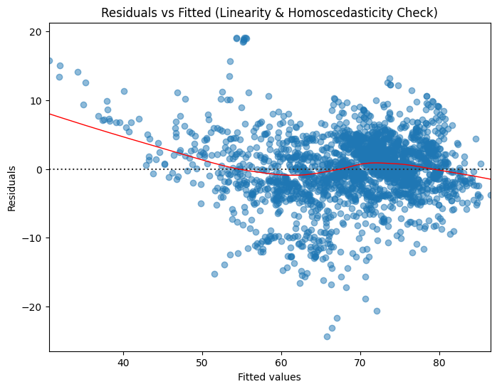
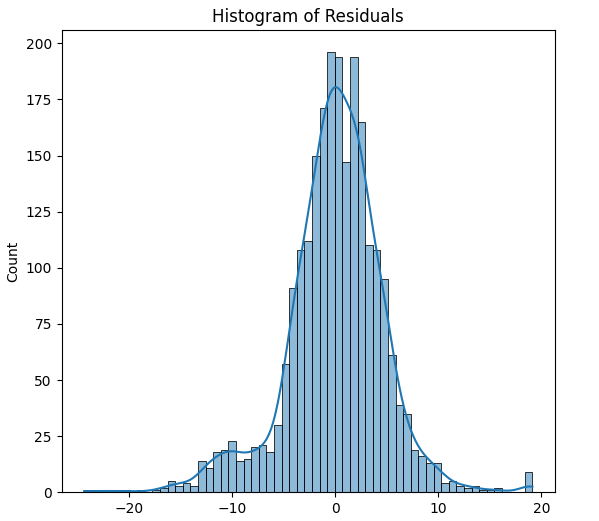
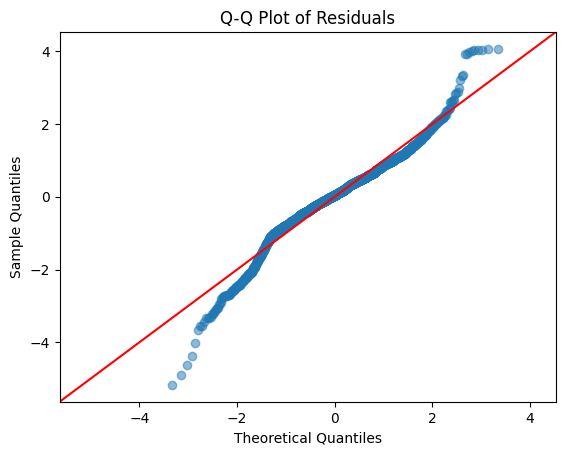

# 📈 Life Expectancy Prediction with Regression Models

This project predicts life expectancy using global health and economic data. Built in Python using sklearn, statsmodels, and LazyPredict.

## 📊 Overview
- Cleaned and imputed real-world dataset from UCI
- Used Linear, Polynomial, and Ensemble models
- Best model: Extra Trees Regressor (R² = 0.97)

## 📁 Files
- `life_expectancy_model_FIXED.ipynb` — full code notebook
- `requirements.txt` — package list
- `images/` — visualizations

## 🔍 Models Tested
- Extra Trees ✅
- Linear Regression
- Polynomial Regression
- Ridge, LGBM, Random Forest, etc.

## 📈 Results Summary

| Model                  | R² Score |
|------------------------|----------|
| Extra Trees Regressor  | 0.97     |
| Random Forest          | 0.96     |
| Linear Regression      | 0.76     |
| Polynomial Regression  | -3.31    |

## 📊 Visual Diagnostics

Below are key visual checks for model assumptions and performance:

### 🔍 Residuals vs Fitted Plot
Checks for linearity and homoscedasticity. Ideally, residuals are evenly spread across the fitted line.

---

### 📈 Histogram of Residuals
Evaluates whether the residuals are normally distributed — a common assumption in regression.

---

### 📏 Q-Q Plot of Residuals
Assesses the normality of residuals by comparing quantiles to a theoretical distribution. Alignment with the red line = good.

## 🧪 Data Source  
[UCI Life Expectancy Dataset](https://www.kaggle.com/datasets/kumarajarshi/life-expectancy-who)
